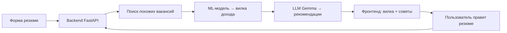

# 💼 ResumeHelper — Оцени свою рыночную стоимость за 5 минут

> **Хакатон Т-Банка**  
> *Сервис, который по резюме предсказывает вилку дохода и даёт персональные рекомендации для роста.*

[](https://fastapi.tiangolo.com/)
[](https://ai.google.dev/gemma)
[](https://developers.cloudflare.com/workers-ai/models/gemma/)
[]()

---

## 🔍 Проблема

Многие соискатели **не знают реальной рыночной стоимости** своих навыков:

- Занижают зарплату → теряют деньги  
- Завышают ожидания → получают отказы  
- Резюме составлено плохо: мало конкретики, не хватает ключевых навыков, опыт описан невнятно  

**Результат** – потерянные возможности и несправедливая зарплата.

---

## 💡 Решение

**ResumeHelper** – это ML‑сервис, который:

1. Анализирует твоё резюме (роль, опыт, навыки, регион)  
2. Находит **похожие вакансии** в датасете российского рынка  
3. Предсказывает **вилку дохода** (от – до руб.)  
4. Даёт **конкретные рекомендации**, что добавить или изменить  
5. Позволяет **пересчитать** результат после правок – вилка растёт!

> 🎯 **Цель** – помочь соискателю быстро понять свою ценность и научить улучшать резюме для роста дохода.

---

## ✨ Функциональные возможности (MVP)

| Сценарий             | Что происходит                                                                                                             |
|----------------------|----------------------------------------------------------------------------------------------------------------------------|
| **1. Первая оценка** | Пользователь заполняет форму → сервис ищет вакансии → показывает вилку и рекомендации                                      |
| **2. Улучшение**     | Пользователь добавляет недостающий навык / уточняет опыт → нажимает «Пересчитать» → вилка растёт, рекомендации обновляются |
| **3. Итерации**      | Можно улучшать резюме несколько раз, пока результат не устроит                                                             |

**На экране результата:**  
- 📊 Доходная вилка  
- 📝 Список персонализированных рекомендаций  
- 🔄 Кнопка «Пересчитать» для быстрой проверки правок

---

## 🧠 Как это работает



- **Поиск вакансий** – по роли, региону, ключевым навыкам (используем датасет российских вакансий)  
- **ML‑модель** – обучена на исторических данных о зарплатах; возвращает доверительный интервал (вилку)  
- **Генерация рекомендаций** – LLM **Google Gemma 4‑26b** через **Cloudflare AI** анализирует резюме и предлагает:  
  *«Добавьте навык X», «Уточните достижения в блоке Y», «Укажите стаж работы с Z»*  

---

## 🛠️ Технологический стек

| Компонент          | Технологии                            |
|--------------------|---------------------------------------|
| **Backend**        | Python 3.12, FastAPI, httpx, Pydantic |
| **ML / LLM**       | Gemma 4‑26b (Cloudflare Workers AI)   |
| **Данные**         | API Работа России                     |
| **Frontend**       | HTML5, CSS, Vanilla JS                |
| **Инфраструктура** | Uvicorn, CORS middleware, env‑конфиги |

---

## 📁 Структура проекта

```
ResumeHelper/
├── backend/
│   ├── services/
│   │   ├── vacancies.py
│   │   └── llm.py
│   ├── placements.py
│   ├── recommendations.py
│   ├── main.py
│   ├── .env.example
│   └── requirements.txt
├── frontend/
│   ├── css/style.css
│   ├── js/app.js
│   └── index.html
├── .gitignore
├── LICENSE
└── README.md
```

---

## 🚀 Быстрый старт (локальный запуск)

### 1. Клонируй репозиторий
```bash
git clone https://github.com/Rav0-main/ResumeHelper.git
cd ResumeHelper
```

### 2. Настрой окружение
Скопируй `.env.example` в `.env` и заполни:
```env
ACCOUNT_ID=your_account_id
API_TOKEN=your_api_token
MODEL=@cf/google/gemma-4-26b-a4b-it
```

### 3. Установи зависимости (backend)
```bash
cd backend
python -m venv venv
source venv/bin/activate   # Linux/Mac
# или .\venv\Scripts\activate  (Windows)
pip install -r requirements.txt
```

### 4. Запусти сервер
```bash
python main.py
```
Сервер запустится на [http://localhost:8000](http://localhost:8000)

### 5. Открой фронтенд
Просто открой `frontend/index.html` в браузере

---

## 🎮 Как использовать (скриншоты)

1. **Форма резюме** – заполните поля (роль, опыт, навыки, регион).  
2. **Результат** – вилка дохода и список советов.  
3. **Улучшайте** – добавьте один недостающий навык, нажмите «Пересчитать» – вилка увеличится.  

---

## 🧪 Генерация рекомендаций через LLM (Gemma)

Используем **Cloudflare Workers AI** с моделью `@cf/google/gemma-4-26b-a4b-it`.  
Промпт формируется из текущего резюме + списка недостающих навыков, найденных в похожих вакансиях.  
Ответ LLM парсится в структурированный список советов.

**Преимущества подхода:**  
- Естественный язык без шаблонов  
- Адаптация под конкретную роль  
- Возможность объяснить **почему** добавление навыка повлияет на зарплату

---

## 🔮 Перспективы развития

- 🧠 Автоматическое улучшение резюме (генерация готового текста)  
- 📊 Дашборд сравнения с рынком по городам и грейдам  
- 🔗 Интеграция с hh.ru – загрузка резюме по ссылке  
- 📱 Мобильное приложение (React Native)

---

## 👥 Команда

> *Сборная УгаБуга*  
> Участники хакатона Т-Банка

---

## 📄 Лицензия

MIT – свободно используйте, дорабатывайте, вдохновляйтесь.

---

## 🙏 Благодарности

- Т-Банк за организацию хакатона и крутые задачи

---

**Попробуйте прямо сейчас:**  
Заполните [форму](frontend/index.html) и узнайте, сколько вы стоите на рынке! 🚀
