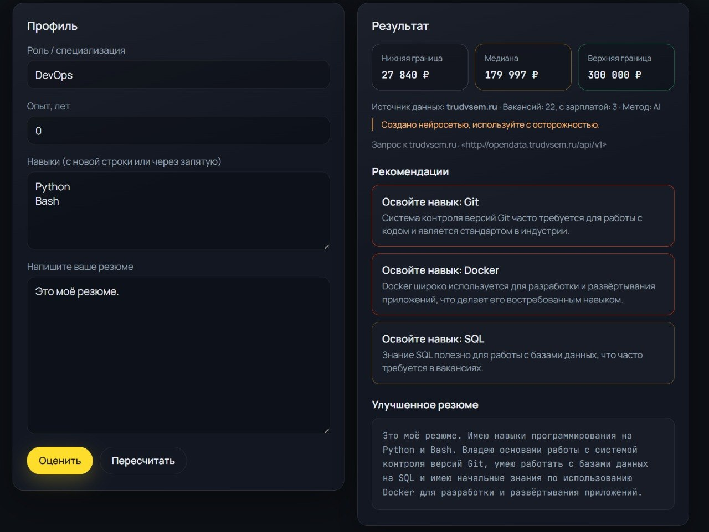
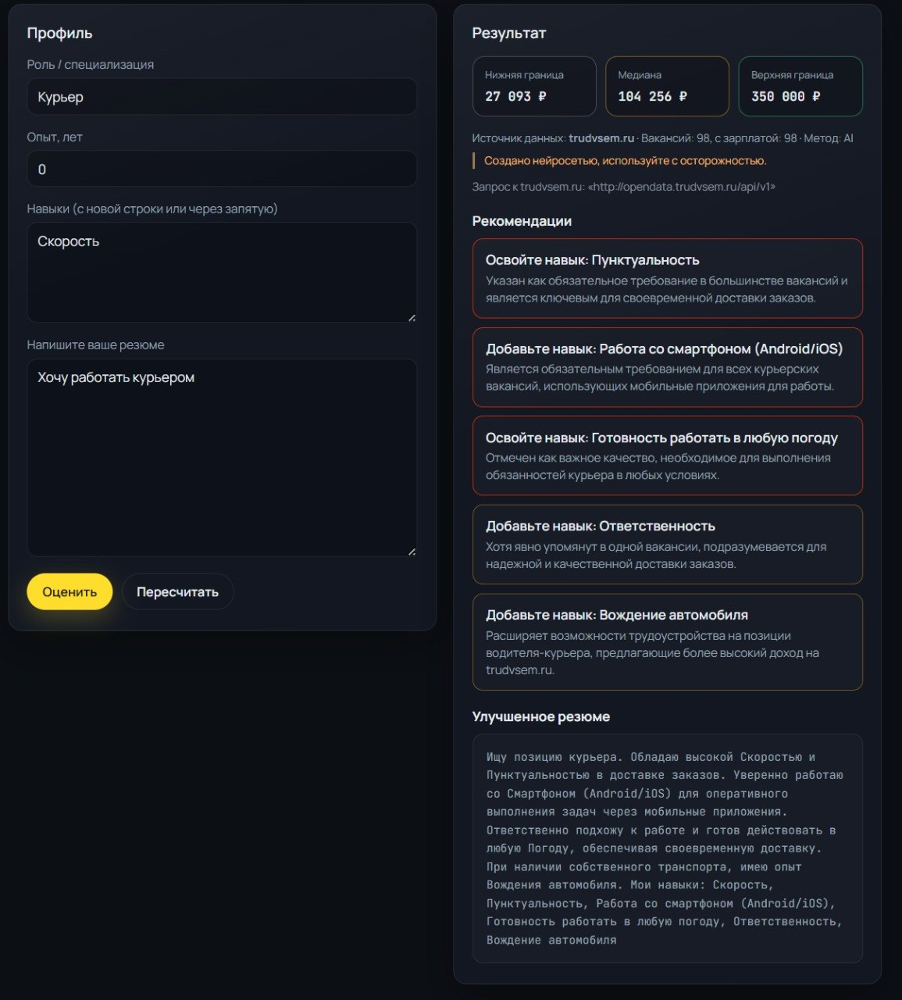
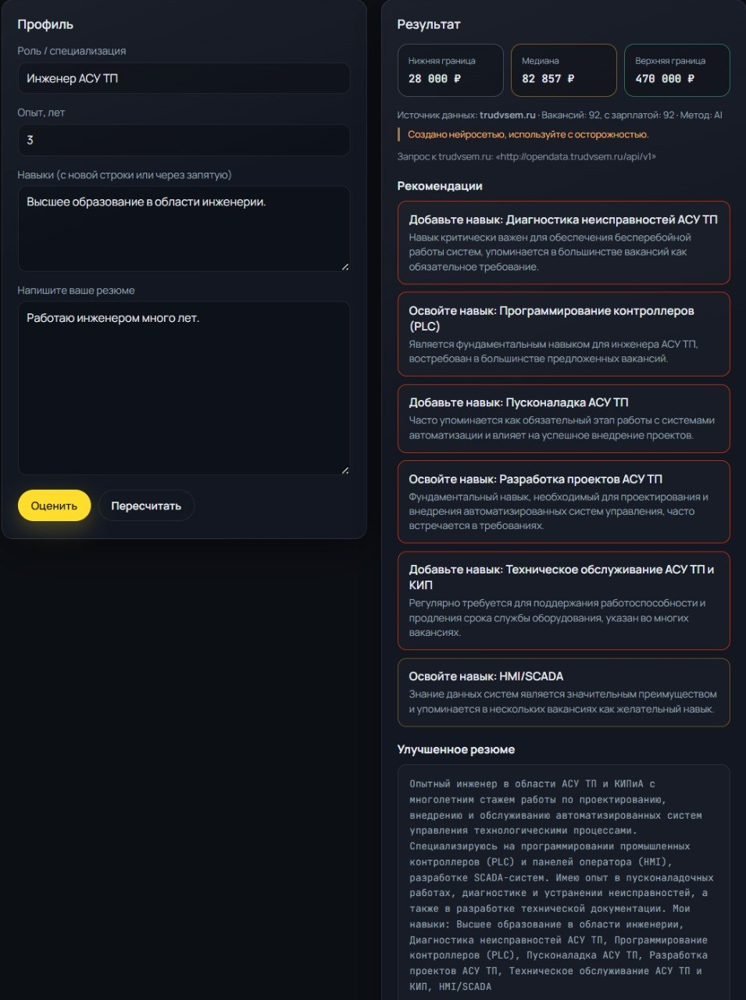

# 💼 ResumeHelper — Оцени свою рыночную стоимость за 5 минут

> **Хакатон Т-Банка**
> *Сервис, который по резюме предсказывает вилку дохода и даёт персональные рекомендации для роста.*

[](https://fastapi.tiangolo.com/)
[](https://cloud.yandex.ru/ru/services/yandexgpt)
[](/frontend/)
[](https://nginx.org)

---

## 🔍 Проблема

Многие соискатели **не знают реальной рыночной стоимости** своих навыков:

- Занижают зарплату → теряют деньги  
- Завышают ожидания → получают отказы  
- Резюме составлено плохо: мало конкретики, не хватает ключевых навыков, опыт описан невнятно  

**Результат** – потерянные возможности и несправедливая зарплата.

---

## 💡 Решение

**ResumeHelper** – это AI‑сервис, который:

1. Анализирует твоё резюме (роль, опыт, навыки, резюме).  
2. Находит **похожие вакансии** в датасете российского рынка.  
3. Предсказывает **вилку дохода** (от – до руб.)  
4. Даёт **конкретные рекомендации**, что добавить или изменить.  
5. Позволяет **пересчитать** результат после правок – вилка растёт!

> 🎯 **Цель** – помочь соискателю быстро понять свою ценность и научить улучшать резюме для роста дохода.

## 🛠️ Технологический стек

|     Компонент      |                  Технологии                  |
|:------------------:|:--------------------------------------------:|
|    **Backend**     |    Python 3.12, FastAPI, httpx, Pydantic     |
|       **AI**       |      YandexGPT (через API Yandex Cloud)      |
|     **Данные**     |              API Работа России               |
|    **Frontend**    |            HTML5, CSS, Vanilla JS            |
| **Инфраструктура** | Uvicorn, CORS middleware, env‑конфиги, nginx |

---

## 📁 Структура проекта

```
ResumeHelper/
├── backend/
│   ├── services/
│   │   ├── vacancies.py        # обрабатывает вакансии с trudvsem.ru
│   │   └── llm.py              # выполняет анализ резюме и даёт рекомендации (YandexGPT)
│   ├── recommendations.py      # основной контроллер для рекомендаций
│   ├── main.py                 # обработка запросов
│   └── requirements.txt        # python зависимости
├── frontend/
│   ├── css/style.css
│   ├── js/app.js
│   └── index.html
├── readmedata/ # скриншоты
│ ├── img_1.png
│ ├── img_2.png
│ └── img_3.png
├── .env.example
├── .gitignore
└── README.md
```

---

## 🚪 API-endpoints

- `GET /api/v1/hello_girl` — проверка "живности" сервера.

**Ответ**:
```json
{
  "title": "Hi. My name is Poli...",
  "detail": "OK"
}
```

- `POST /api/v1/recommendations` — получение рекомендации на основе данных.

**Запрос**:
```json
{
  "role": String,
  "years_experience": Integer,
  "skills": String,
  "resume": String
}
```

**Ответ**:
- **HTTP 200**
```json
{
  "salary_range_rub_gross_monthly": {
    "low": Integer,
    "median": Integer,
    "high": Integer
  },

  "method": String,
  
  "data_source": String,
  "data_source_note": String,
  
  "vacancies_used": Integer,
  "vacancies_with_salary": Integer,
  
  "recommendations": [
    {
      "title": String,
      "detail": String,
      "impact": String
    }
  ]
}
```

- **Иначе**

`Стандартные коды ошибок HTTP.`

---

## 🚀 Как запустить?

### 1. Клонирование репозитория

```bash
git clone https://github.com/Rav0-main/ResumeHelper.git
cd ResumeHelper
```

### 2. Настройка окружения

#### .env

Создайте файл `.env` в корне проекта по примеру из [.env.example](/.env.example).
Для **YandexGPT** необходимы:

```bash
FOLDER_ID="ВАШ_FOLDER_ID"
API_KEY="ВАШ_API_КЛЮЧ"
YANDEX_MODEL="yandexgpt"          # или другая модель
YANDEX_TEMPERATURE="0.3"          # опционально
YANDEX_MAX_TOKENS="2000"          # опционально
```

> **Как получить**:
> - `FOLDER_ID` – идентификатор каталога в [Yandex Cloud](https://console.cloud.yandex.ru/cloud?section=overview).
> - `API_KEY` – [создайте API-ключ](https://cloud.yandex.ru/docs/iam/operations/api-key/create) для сервисного аккаунта с ролью `ai.languageModels.user`.

### 3. Установка зависимостей backend'a

```bash
python3 -m venv .venv # Linux/Mac
# или python -m venv .venv (Windows)

source .venv/bin/activate   # Linux/Mac
# или .\.venv\Scripts\activate  (Windows)

pip3 install -r backend/requirements.txt # Linux/Mac
# или pip install -r requirements.txt  (Windows)
```

### 4. Запуск application-сервера

```bash
cd backend

python3 main.py # Linux/Mac
# или python main.py # (Windows)
```

### 5. Запуск web-сервера

Настройте конфигурацию `nginx.conf` по примеру из [nginx.conf.example](/nginx.conf.example).
Требуется просто поменять директорию фронтенда (19 строка), т.е. `/.../frontend/`.

---

## 🎮 Как использовать

1. **Форма резюме** – заполните поля (роль, опыт, навыки, резюме).
2. **Результат** – вилка дохода и список советов
3. **Улучшайте** – добавьте один недостающий навык, нажмите «Пересчитать».

### Примеры работы сервиса





---

## 🧪 Генерация рекомендаций через YandexGPT

Промпт формируется из текущего резюме + списка недостающих навыков, найденных в похожих вакансиях.
Модель вызывается через `https://llm.api.cloud.yandex.net/foundationModels/v1/completion`.

**Преимущества подхода:**  
- Естественный язык без шаблонов.
- Адаптация под конкретную роль.
- Возможность объяснить **почему** добавление навыка повлияет на зарплату.

---

## 👥 Команда

> *Сборная УгаБуга*
> 
> [Rav0](https://github.com/Rav0-main)
> 
> [Aleksandr](https://github.com/GilderDragon)
> 
> [Виктор](https://github.com/skyfomm)
> 
> [Julia26047](https://github.com/Julia26047)

---

## 📄 Лицензия

MIT – свободно используйте, дорабатывайте, вдохновляйтесь.

---
